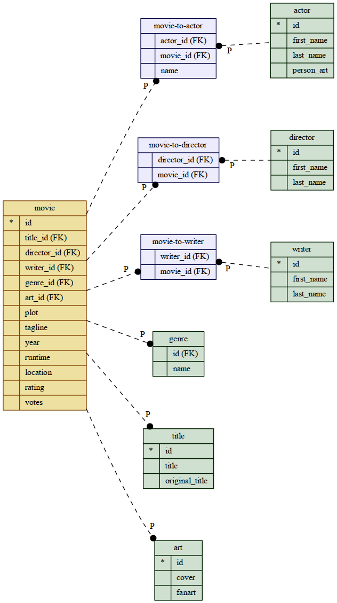

.. Movie Database with Apex documentation master file, created by
   sphinx-quickstart on Mon Apr 22 16:06:30 2013.
   You can adapt this file completely to your liking, but it should at least
   contain the root `toctree` directive.

Dokumentation
=============

Einleitung
----------

Im Rahmen der Studienarbeit Entwicklung von Webanwendungen soll eine Apex
Applikation realisiert werden. 

Datenbankschema
---------------

Folgende Tabellen, welche normalisiert werden müssen liegen vor.

 * **movie**, titel, director, crew, ...
 * **director**, first_name, last_name, ...
 * **writer**, first_name, last_name, ...
 * **actor**, first_name, last_name, ...

Normalisiertes Datanbankschema
------------------------------

